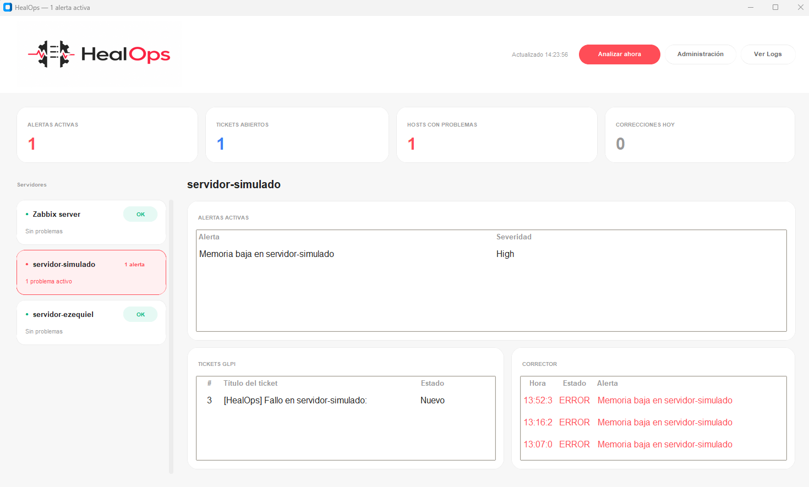

# HealOps

Sistema de resolución automática de incidencias de infraestructura. Zabbix detecta el problema, Python con Pandas filtra los falsos positivos, un script Bash intenta la corrección, y si no puede resolverlo abre un ticket en GLPI. Todo se visualiza en un panel de CustomTkinter.

Proyecto de portfolio para demostrar una pipeline SRE/DevOps real.



---

## Flujo

```
Zabbix detecta un problema
         │
         ▼
analizador_alertas.py
  ├── Pandas filtra severity < 4 → falso positivo (se descarta)
  └── severity ≥ 4 → alerta real
              │
              ▼
      Ejecuta script Bash de corrección
              │
        ┌─────┴─────┐
        │           │
       OK         FALLO
        │           │
    Log OK    Abre ticket en GLPI
              │
              ▼
   Siguiente ciclo: si la alerta desaparece → cierra el ticket
              │
              ▼
    panel/app.py lo muestra todo en tiempo real
```

---

## Tecnologías

| Capa | Tecnología |
|---|---|
| Monitorización | Zabbix 7.0 (API JSON-RPC) |
| Tickets | GLPI (REST API legacy) |
| Análisis | Python 3.12 + Pandas |
| Corrección | Scripts Bash |
| Panel | CustomTkinter + PIL |
| Infraestructura | Docker Compose |
| Credenciales | python-dotenv |

---

## Características

- Pandas separa alertas reales (severity ≥ 4) del ruido
- Mapeo por palabras clave: cada alerta se asocia con el script de corrección adecuado
- Tickets en GLPI solo si la corrección falla; se evitan duplicados comprobando si ya hay uno abierto
- Cuando Zabbix resuelve la alerta, el ticket se cierra automáticamente
- Panel con KPIs, lista de hosts, alertas, tickets y historial del corrector
- `setup/setup_zabbix.py` crea los triggers en todos los hosts con una sola ejecución
- Rotación de logs automática a 1 MB por archivo

---

## Estructura

```
HealOps/
├── docker/
│   ├── docker-compose.yml      # MySQL, Zabbix server/web/agents, GLPI
│   └── init-db.sql
├── monitor/
│   └── analizador_alertas.py   # Motor principal: fetch → filtro → corrección → ticket
├── gestor_tickets/
│   └── cliente_glpi.py         # Cliente REST de GLPI
├── corrector/
│   ├── liberar_cpu.sh
│   ├── liberar_memoria.sh
│   ├── limpiar_swap.sh
│   ├── limpiar_disco.sh
│   ├── limpiar_zombies.sh
│   └── reiniciar_ssh.sh
├── panel/
│   ├── app.py                  # Panel CustomTkinter
│   └── tema.py                 # Colores, fuentes y estilos
├── setup/
│   └── setup_zabbix.py         # Crea triggers en Zabbix vía API
├── img/
│   └── HealOps Icon.png
├── scheduler.py                # Ejecuta el analizador cada 5 minutos en bucle
├── requirements.txt
└── .env                        # Credenciales (no se sube al repo)
```

---

## Requisitos

- Docker + Docker Compose
- Python 3.10 o superior

---

## Instalación

**1. Clonar y configurar credenciales**

```bash
git clone https://github.com/EzequielHidalgoDev/HealOps.git
cd HealOps
cp .env.example .env
# Editar .env con los datos de Zabbix y GLPI
```

**2. Levantar la infraestructura**

```bash
docker compose -f docker/docker-compose.yml up -d
```

| Servicio | URL |
|---|---|
| Zabbix | http://localhost:8080 — Admin / zabbix |
| GLPI | http://localhost:8081 — glpi / glpi |

**3. Entorno Python**

```bash
python -m venv venv
venv\Scripts\activate        # Windows
# source venv/bin/activate   # Linux/Mac
pip install -r requirements.txt
```

**4. Crear los triggers en Zabbix**

```bash
python setup/setup_zabbix.py
```

Crea 9 triggers (CPU, memoria, disco, swap, carga, SSH, zombies) en todos los hosts. Si el item no existe en el host o el trigger ya está creado, lo salta sin error.

**5. Lanzar el scheduler**

```bash
python scheduler.py
```

Ejecuta el analizador cada 5 minutos en bucle de forma automática. Para correrlo una sola vez:

```bash
python monitor/analizador_alertas.py
```

En producción Linux se puede usar cron en lugar del scheduler:

```
*/5 * * * * /ruta/venv/bin/python /ruta/monitor/analizador_alertas.py
```

**6. Abrir el panel**

```bash
python panel/app.py
```

El panel y el scheduler corren en paralelo en terminales separadas. El panel solo visualiza; el scheduler es quien detecta, corrige y gestiona los tickets.

---

## Variables de entorno

Crear un archivo `.env` en la raíz del proyecto:

```env
ZABBIX_URL=http://localhost:8080/api_jsonrpc.php
ZABBIX_USER=Admin
ZABBIX_PASSWORD=zabbix

GLPI_URL=http://localhost:8081/apirest.php
GLPI_APP_TOKEN=tu_app_token
GLPI_USER_TOKEN=tu_user_token
```

Puedes copiar `.env.example` como punto de partida:
```bash
cp .env.example .env
```

**Cómo obtener los tokens de GLPI:**
1. Entra en GLPI → Configuración → General → API
2. Activa la API REST y copia el **App Token**
3. Ve a tu perfil de usuario → Ajustes → Token de API → Regenerar y copia el **User Token**

---

## Criterio de filtrado

| Severity de Zabbix | Etiqueta | Acción |
|---|---|---|
| 0–3 | Info / Warning / Average | Descartado como falso positivo |
| 4 | High | Corrección automática |
| 5 | Disaster | Corrección automática |

---

## Mapeo de correcciones

El nombre de la alerta se compara con estas palabras clave:

| Palabra clave | Acción |
|---|---|
| `swap` | Limpia `/tmp` |
| `cpu` / `carga` | Diagnóstica el proceso con más CPU y escala |
| `memo` | Libera caché de memoria |
| `disco` | Elimina logs y temporales antiguos |
| `zombie` | Intenta matar el proceso padre, escala si persiste |
| `ssh` | Escala directamente a GLPI |

Si la alerta no coincide con ninguna clave, se abre un ticket directamente.

---

## Notas de producción

En local, la corrección se ejecuta con `docker exec`. En producción, los scripts Bash hacen SSH al servidor afectado. Las credenciales SSH se configurarían en `.env` por host (`SSH_HOST_nombre`, `SSH_USER_nombre`, `SSH_KEY_nombre`).

---

## Despliegue en servidor real

La infraestructura está diseñada para desplegarse en un VPS (DigitalOcean, Hetzner, AWS...) y ser accesible desde cualquier máquina de la red.

**1. Instalar Docker en el servidor**
```bash
ssh root@IP_DEL_SERVIDOR
curl -fsSL https://get.docker.com | sh
```

**2. Subir el proyecto**
```bash
# Desde tu máquina local
scp -r docker/ root@IP_DEL_SERVIDOR:/opt/healops/
scp .env root@IP_DEL_SERVIDOR:/opt/healops/
```
O hacer `git clone` directamente en el servidor.

**3. Levantar los contenedores**
```bash
cd /opt/healops
docker compose -f docker/docker-compose.yml up -d
```

**4. Abrir puertos en el firewall del VPS**
- 8080 → Zabbix
- 8081 → GLPI

**5. Configurar el `.env` en cada cliente**
```env
ZABBIX_URL=http://IP_DEL_SERVIDOR:8080/api_jsonrpc.php
GLPI_URL=http://IP_DEL_SERVIDOR:8081/apirest.php
```

Con esto, el `HealOps.exe` funciona en cualquier máquina que tenga el `.env` apuntando al servidor. No hace falta instalar Python ni Docker en los clientes.

---

## Autor

**Ezequiel Hidalgo** — [GitHub](https://github.com/EzequielHidalgoDev)
